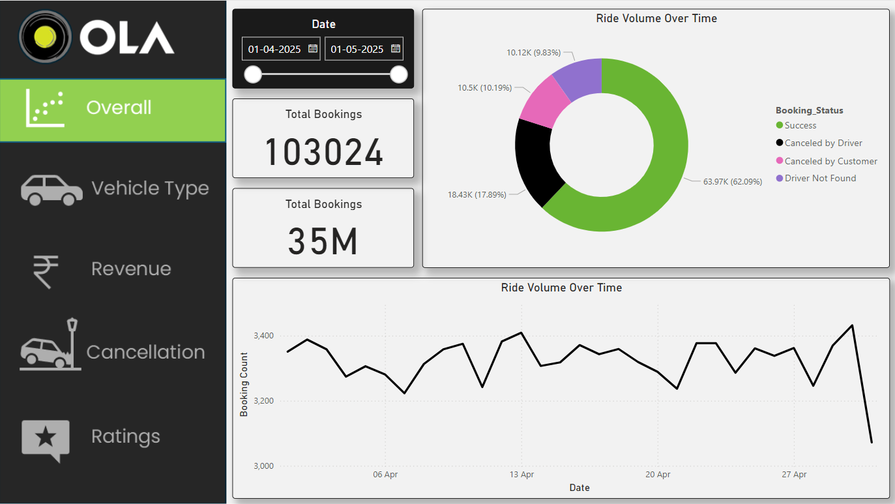
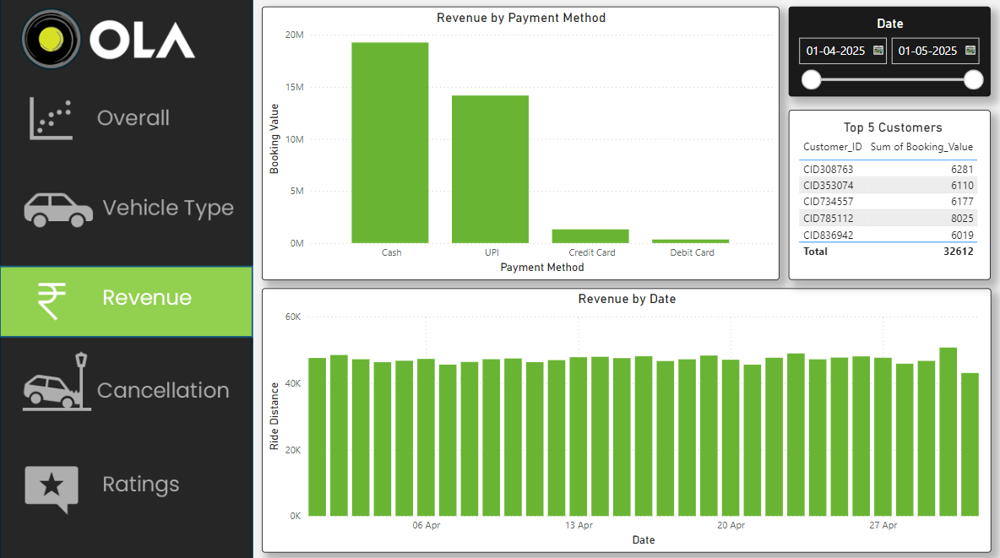
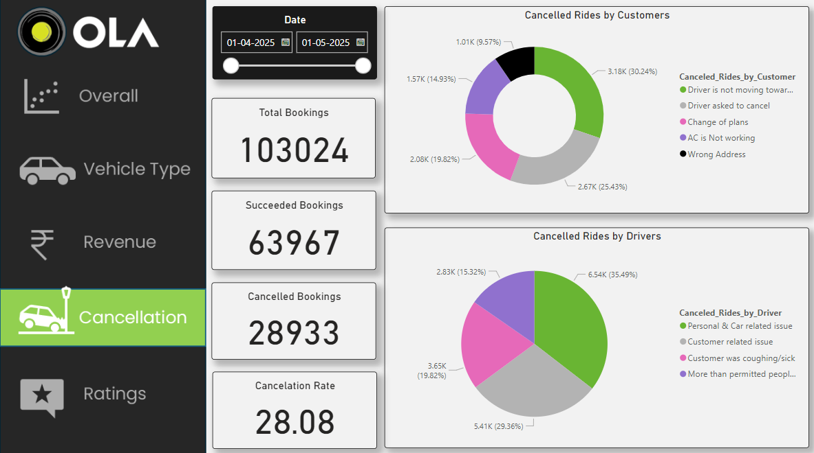
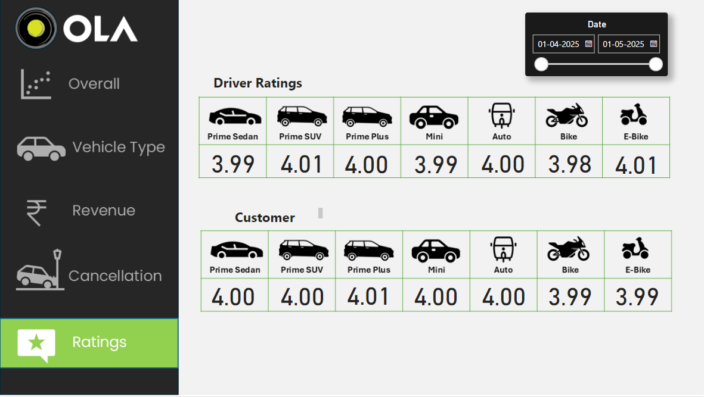

# 🚖 OLA Data Analyst Project 🚖

This project analyzes Ola ride booking data to uncover trends in bookings, cancellations, 
payments, and customer/driver ratings. Using SQL for data querying and Power BI for visualization, 
the analysis helps identify business insights that can improve operations and customer satisfaction.

---
### Raw Dataset


---

## 📁 Project Structure

```
Ola Project
├── 📁pic                              # Folder containing visual assets
├── Bookings.csv                     # Raw dataset used for analysis
├── OLA-Data-Analyst-Project-1.pdf   # Project case study or problem statement
├── Ola Dashboard.pbit               # Power BI dashboard file
├── Ola_Project.sql                  # SQL queries used for exploratory data analysis (EDA)
└── README.md                        # Project documentation
```

---

## 📌 Objective

To explore Ola’s booking dataset and answer key business questions about:

- Booking success and failure
- Ride distance and vehicle types
- Cancellations and reasons
- Revenue, payment methods, and ratings
- Customer behavior patterns

---

## 🔍 SQL Questions Answered

1. Retrieve all successful bookings  
2. Find the average ride distance for each vehicle type  
3. Get the total number of cancelled rides by customers  
4. List the top 5 customers who booked the highest number of rides  
5. Get the number of rides cancelled by drivers due to personal and car-related issues  
6. Find the maximum and minimum driver ratings for Prime Sedan bookings  
7. Retrieve all rides where payment was made using UPI  
8. Find the average customer rating per vehicle type  
9. Calculate the total booking value of rides completed successfully  
10. List all incomplete rides along with the reason 

---

## 📊 Power BI Visualizations

<table>
  <tr>
    <td></td>
    <td></td>
    <td></td>
  </tr>
</table>
<table>
  <tr>
    <td></td>
    <td></td>
  </tr>
</table>


---

## 💡 Key Insights

- Most rides were successful, with cancellations peaking at night.
- Sedans had the longest average ride distance and highest booking value.
- Driver unavailability was the top reason for cancellations.
- Ratings averaged above 4 for most vehicle types, reflecting high satisfaction.
- UPI was the most used payment method for completed bookings.

---

## 🧰 Tools & Technologies

- **SQL** – For EDA, aggregations, and filtering logic
- **Power BI** – For dashboard development and visualization
- **CSV** – As the raw dataset
- **PDF** – For project brief

---

## 📝 How to Use

1. Open `Bookings.csv` to view raw ride data.
2. Run `Ola_Project.sql` to explore and analyze the dataset using SQL.
3. Load `Ola Dashboard.pbit` in Power BI to interact with the dashboard.
4. Use `.png` charts in `pic/` for reports or slides.

---

## 🙋‍♂️ Author

**Jaykumar Tamkhane**  
Aspiring Data Analyst | SQL | Power BI | Python | AWS

- 🔗 [LinkedIn](https://www.linkedin.com/in/jay-tamkhane)
- 💻 [GitHub](https://github.com/jaytamkhane)


